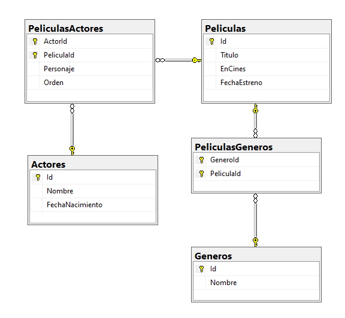

# Introducción 

En este proyecto se puede crear películas, actores y géneros, los usuarios podrán modificar las películas agregando o quitando géneros al igual que con los actores.

Utilicé varias tecnologías para crear la aplicación en back-end
.NET 7, SQL Server, Entity Framework Core, reglas de ruteo, automaper, github.

# Entidades usadas

- Peliculas: Entidad usada para almacenar información de las películas
- Actores:  Entidad usada para almacenar información de los actores
- Géneros:  Entidad usada para almacenar información de los géneros
- PeliculasActores: Entidad usada para manejar el modelo varios a varios entre las entidades Película y Actor
- PeliculasGeneros: Entidad usada para manejar el modelo varios a varios entre las entidades Película y Género.

## Entity Framework Core

# Controladores

## PeliculasController
### Get
- urlbase/api/peliculas
- urlbase/api/peliculas/id
### Post
- urlbase/api/peliculas
### Put
- urlbase/api/peliculas/id
### Delete
- urlbase/api/peliculas/id

## ActoresController
### Get
- urlbase/api/actores
- urlbase/api/actores/id
### Post
- urlbase/api/actores
### Put
- urlbase/api/actores/id
### Delete
- urlbase/api/actores/id

## GenerosController
### Get
- urlbase/api/generos
- urlbase/api/generos/id
### Post
- urlbase/api/generos
### Put
- urlbase/api/generos/id
### Delete
- urlbase/api/generos/id

